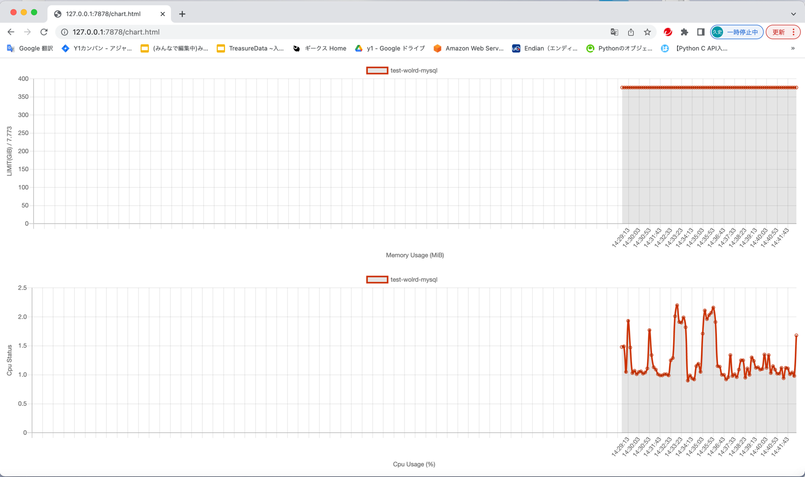

# rust_docker_metrics

- メトリクスを意識したバッチ作成をすべきと考えメトリクスの記録を横軸で残したいというモチベで作成した。

## ビルドと起動方法

- 以下のコマンドを叩いてビルド&起動する(dockerが動作していることが前提)

```asm
$ cargo build
$ ls -al target/debug/rust_metrics    # ファイルの存在確認
$ chmod +x target/debug/rust_metrics  # 権限付与
$ ./target/debug/rust_metrics      
```

- 以下のurlでアクセス
  - http://127.0.0.1:7878/chart.html
  - 10秒間隔でdocker上で動作するメトリクスを表示します。
  - 360回 x 10秒間隔で取得するので1時間分の動作状況を表示します。

  - 
  - 

## 課題
  - 一旦初回作品なので、まずは動くものをということを目標に作りました。課題としてい以下があげれれるかと思っています。
    - mainファイルだけで組んでいる。構造体とか別ファイルで管理したいところ。
    - エラーハンドリングはもう少し手を加えられそう。
    - テストコードもあればなお理想。